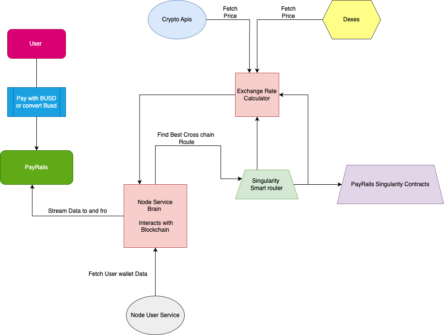

# Project Name: Payrails - Decentralized Digital Payment Solution

Project Overview:

BNB Payrails is an innovative decentralized payment solution powered by Binance USD (BUSD) to address the complexities of cross-chain payments, token swaps, and on/off-ramping. In an ecosystem where users frequently engage across multiple blockchains, BNB Payrails offers a streamlined and stable solution for both users and merchants to transact and convert tokens seamlessly across networks.

Key Features:
 1. Unified Payment Integration for Merchants and Users
Merchants can integrate the BNB Payrails SDK, enabling customers to choose their preferred tokens for transactions directly on the merchant’s site. The SDK manages token conversion, swapping, and bridging in the background, allowing merchants to accept BUSD and other stablecoins without dealing with cross-chain complexities.
 2. Easy Token Conversion and On-Ramping
Users can convert their existing tokens (e.g., USDT, MATIC) from popular networks such as Binance Smart Chain, Ethereum, Polygon, and Arbitrum into BUSD through a single transaction. The platform supports both gasless transactions via EIP-712 where available and traditional gas payments where necessary, simplifying the approval process.
 3. Stablecoin-Driven Checkout System
BNB Payrails integrates with user wallets (e.g., MetaMask), allowing users to pay with BUSD or swap and bridge their assets. The platform fetches token balances via QuickNode and other APIs, providing users with a real-time view of assets available for conversion into BUSD.
 4. Efficient On-Ramp with MoonPay Integration
Users can easily purchase BUSD using debit or credit cards via MoonPay, bypassing the typical multi-step process for acquiring BUSD from exchanges.
 5. Flexible Cross-Chain Payments
Whether users need to convert BUSD into tokens on other networks or use their existing tokens to acquire BUSD, BNB Payrails enables seamless bridging and swapping, supporting transactions across Binance Smart Chain, Ethereum, Polygon, and more.

Technical Highlights:
 • Powered by QuickNode: Real-time data fetching of token balances and chain information.
 • EIP-712 Support: Gasless approvals where supported, providing a single-click payment experience.
 • Broad Token Compatibility: Users can select from tokens available on multiple chains, with automatic bridging and conversion to simplify checkout.

User Flow:
 1. Connect Wallet: Users connect their wallet (e.g., MetaMask) on any merchant site integrated with BNB Payrails.
 2. Select Payment Method: Users choose between paying with BUSD or converting from other tokens.
 3. Seamless Approval and Payment: The platform manages conversions, approvals, and transaction submissions automatically, allowing users to complete transactions with BUSD in just a few clicks.